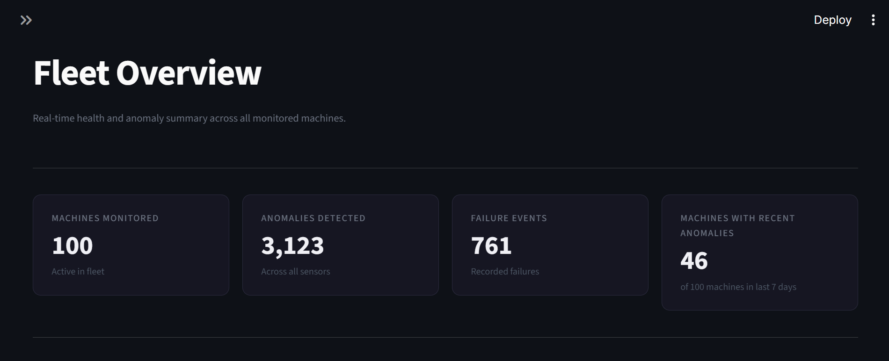
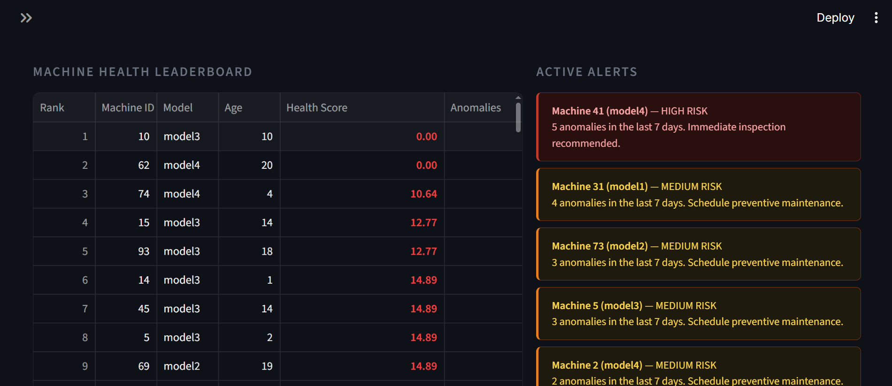
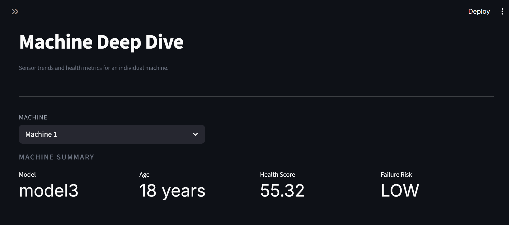
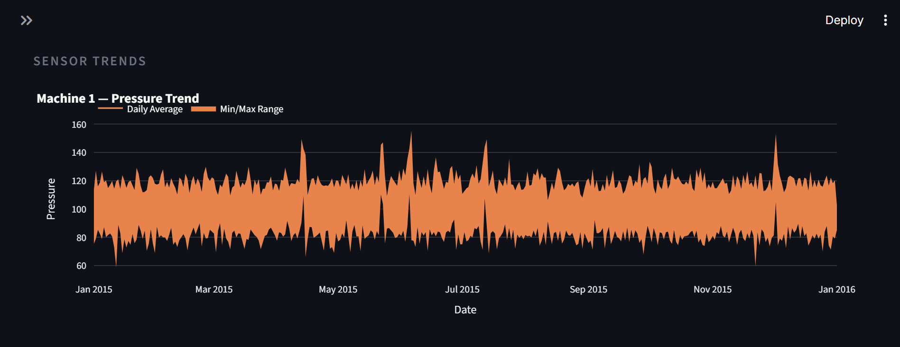
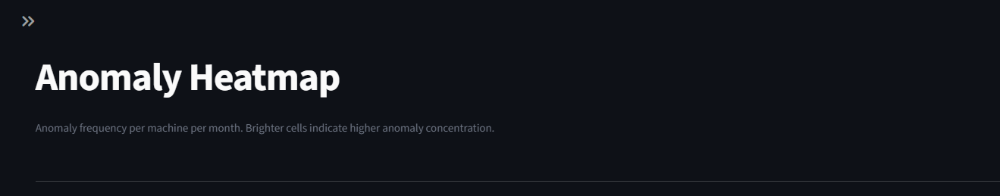
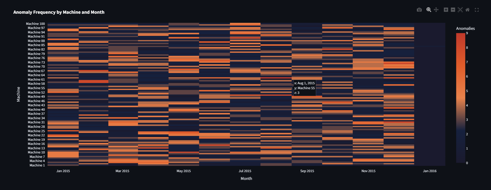

# IoT Sensor Analytics & Predictive Maintenance Pipeline


An end-to-end industrial IoT pipeline that ingests raw machine sensor telemetry, transforms it into a dimensional warehouse schema, detects anomalous sensor behavior using rolling z-score analysis, computes machine health scores, and delivers operational insights through an interactive Streamlit dashboard.

---

## Pipeline Architecture

```
Raw CSV Files (Kaggle)
        │
        ▼
┌─────────────────────┐
│   Ingestion Layer   │  Python + Pandas — CSV parsing, validation, staging insert
└─────────────────────┘
        │
        ▼
┌─────────────────────┐
│   Staging Schema    │  PostgreSQL — raw TEXT columns, idempotent TRUNCATE loads
└─────────────────────┘
        │
        ▼
┌─────────────────────┐
│     ETL Layer       │  SQLAlchemy — type casting, unpivoting, surrogate key resolution
└─────────────────────┘
        │
        ▼
┌─────────────────────┐
│  Warehouse Schema   │  Star schema — 4 dimension tables, 5 fact tables
└─────────────────────┘
        │
        ▼
┌─────────────────────┐
│  Anomaly Detection  │  NumPy — rolling z-score per machine per sensor
└─────────────────────┘
        │
        ▼
┌─────────────────────┐
│  Analytics Module   │  Health scores, failure risk signals, query layer
└─────────────────────┘
        │
        ▼
┌─────────────────────┐
│ Streamlit Dashboard │  Fleet Overview · Machine Deep Dive · Anomaly Heatmap
└─────────────────────┘
```

---

## Dataset

**Microsoft Azure IoT Predictive Maintenance**
Source: [Kaggle — arnabbiswas1](https://www.kaggle.com/datasets/arnabbiswas1/microsoft-azure-predictive-maintenance)

100 machines monitored over one year of hourly telemetry across four sensor types.

| File | Description | Rows |
|---|---|---|
| `PdM_telemetry.csv` | Hourly voltage, rotation, pressure, vibration readings | 876,100 |
| `PdM_machines.csv` | Machine model and age attributes | 100 |
| `PdM_errors.csv` | Timestamped error events per machine | 3,919 |
| `PdM_failures.csv` | Component failure events | 761 |
| `PdM_maint.csv` | Maintenance service records | 3,286 |

---

## Tech Stack

| Layer | Technology |
|---|---|
| Language | Python 3.11 |
| Database | PostgreSQL 15 |
| ORM / DB Layer | SQLAlchemy 2.0 + psycopg2 |
| Data Processing | Pandas 2.2 + NumPy 1.26 |
| Dashboard | Streamlit 1.35 + Plotly 5.22 |
| Containerization | Docker + Docker Compose |
| Environment | python-dotenv |

---

## Data Model

The warehouse follows a **star schema** design with two PostgreSQL schemas: `staging` for raw data landing and `warehouse` for analytics-ready tables.

### Dimension Tables

| Table | Description |
|---|---|
| `dim_machine` | One row per machine — model and age attributes |
| `dim_sensor_type` | Sensor type lookup with physical units |
| `dim_error_type` | Error code lookup (error1–error5) |
| `dim_failure_type` | Failure component lookup (comp1–comp4) |

### Fact Tables

| Table | Rows | Description |
|---|---|---|
| `fact_sensor_readings` | 3,504,400 | One row per machine per timestamp per sensor (unpivoted) |
| `fact_anomaly_events` | 3,123 | Anomaly events written by detection module |
| `fact_errors` | 3,919 | Timestamped error events with dimension keys |
| `fact_failures` | 761 | Timestamped failure events with dimension keys |
| `fact_maintenance` | 3,286 | Maintenance records with dimension keys |

> The telemetry fact table is unpivoted from four sensor columns into one row per sensor reading. This enables filtering and aggregation by sensor type without dynamic column references - a core dimensional modeling principle.

---

## Anomaly Detection

Rolling z-score detection computed per machine per sensor combination.

| Parameter | Value |
|---|---|
| Method | Rolling z-score |
| Window | 24 hours (matches hourly telemetry cadence) |
| Threshold | \|z\| > 3.0 standard deviations |
| Anomalies detected | 3,123 events across 100 machines |

The rolling baseline adapts to local signal drift, avoiding false positives from seasonal or long-term operational shifts. A global z-score would incorrectly flag baseline changes as anomalies - the rolling window is deliberate.

---

## Dashboard

Three-page interactive Streamlit dashboard served at `localhost:8501`.

### Fleet Overview

KPI cards showing fleet-level metrics, a machine health leaderboard with risk-colored scores, and plain language active alerts for machines flagged in the last 7 days.




### Machine Deep Dive

Per-machine sensor trend charts with daily averages and min/max bands across all four sensor types, plus individual machine health and risk metrics.




### Anomaly Heatmap

Full fleet anomaly frequency by machine and month. Brighter cells indicate higher anomaly concentration.




---

## Project Structure

```
iot-predictive-maintenance/
│
├── docker-compose.yml              # PostgreSQL + Streamlit services
├── Dockerfile.streamlit            # Streamlit container image
├── requirements.txt                # Pinned Python dependencies
├── .env.example                    # Credential template
├── .dockerignore
│
├── data/
│   └── raw/                        # Kaggle CSVs — gitignored
│
├── db/
│   ├── __init__.py
│   └── connection.py               # SQLAlchemy engine, session factory, pool config
│
├── ingestion/
│   ├── __init__.py
│   ├── schema_staging.py           # Staging table DDL
│   └── loader.py                   # CSV ingestion with validation and idempotent inserts
│
├── etl/
│   ├── __init__.py
│   ├── schema_warehouse.py         # Warehouse DDL — dimensions, facts, indexes
│   └── transform.py                # Dimension and fact table loaders
│
├── analytics/
│   ├── __init__.py
│   ├── anomaly_detection.py        # Rolling z-score detection pipeline
│   ├── health_scores.py            # Machine health score and failure risk computation
│   └── queries.py                  # Reusable analytical query layer
│
├── dashboard/
│   ├── app.py                      # Streamlit entry point and page routing
│   └── components/
│       ├── kpi_cards.py
│       ├── trend_charts.py
│       ├── anomaly_heatmap.py
│       ├── health_leaderboard.py
│       └── alert_summary.py
│
└── scripts/
    ├── test_connection.py
    ├── run_ingestion.py
    ├── run_etl.py
    ├── run_anomaly_detection.py
    └── run_analytics.py
```

---

## Setup and Running

### Prerequisites

- [Docker Desktop](https://www.docker.com/products/docker-desktop)
- Python 3.11+
- Kaggle account (for dataset download)

### 1. Clone the repository

```bash
git clone https://github.com/credough/iot-predictive-maintenance.git
cd iot-predictive-maintenance
```

### 2. Configure environment

```bash
cp .env.example .env
```

Edit `.env` with your preferred database credentials:

```env
POSTGRES_HOST=localhost
POSTGRES_PORT=5433
POSTGRES_DB=iot_maintenance
POSTGRES_USER=your_user
POSTGRES_PASSWORD=your_password
STREAMLIT_PORT=8501
```

### 3. Download the dataset

Download from [Kaggle](https://www.kaggle.com/datasets/arnabbiswas1/microsoft-azure-predictive-maintenance) and place CSV files in `data/raw/`:

```
data/raw/
├── PdM_telemetry.csv
├── PdM_machines.csv
├── PdM_errors.csv
├── PdM_failures.csv
└── PdM_maint.csv
```

### 4. Start containers

```bash
docker compose up -d
```

### 5. Set up Python environment

```bash
python -m venv venv

# Windows
venv\Scripts\activate

# macOS / Linux
source venv/bin/activate

pip install -r requirements.txt
```

### 6. Run the pipeline

```bash
# Stage raw CSV data into PostgreSQL
python scripts/run_ingestion.py

# Transform staged data into warehouse star schema
python scripts/run_etl.py

# Run rolling z-score anomaly detection
python scripts/run_anomaly_detection.py
```

### 7. Open the dashboard

Navigate to [http://localhost:8501](http://localhost:8501)

---

## Key Engineering Decisions

**Staging layer uses TEXT columns.** Type enforcement is deferred entirely to the ETL layer. Raw data lands in staging regardless of upstream format issues — malformed timestamps, null sensor values, and encoding problems are handled in transformation, not ingestion.

**Telemetry unpivoted from wide to long format.** The raw data has four sensor columns per row. The warehouse model unpivots this into one row per sensor reading, enabling sensor-type filtering and aggregation without dynamic column references and making the fact table structure extensible to new sensor types.

**Idempotent pipeline throughout.** Every load step executes `TRUNCATE ... RESTART IDENTITY` before inserting. The full pipeline is safe to re-run at any stage without producing duplicate data.

**Rolling z-score over global z-score.** A global threshold would flag seasonal and operational baseline shifts as anomalies. A rolling window adapts to local signal behavior, which is how industrial monitoring systems behave in practice.

**Query layer separated from dashboard layer.** All SQL lives in `analytics/queries.py`. Dashboard components import functions, not queries. This keeps analytical logic independently testable and reusable outside the dashboard context.

**Single database connection module.** All pipeline components import from `db/connection.py`. Connection pooling, credential loading, and engine configuration are defined once — not repeated across modules.

---

## License

MIT